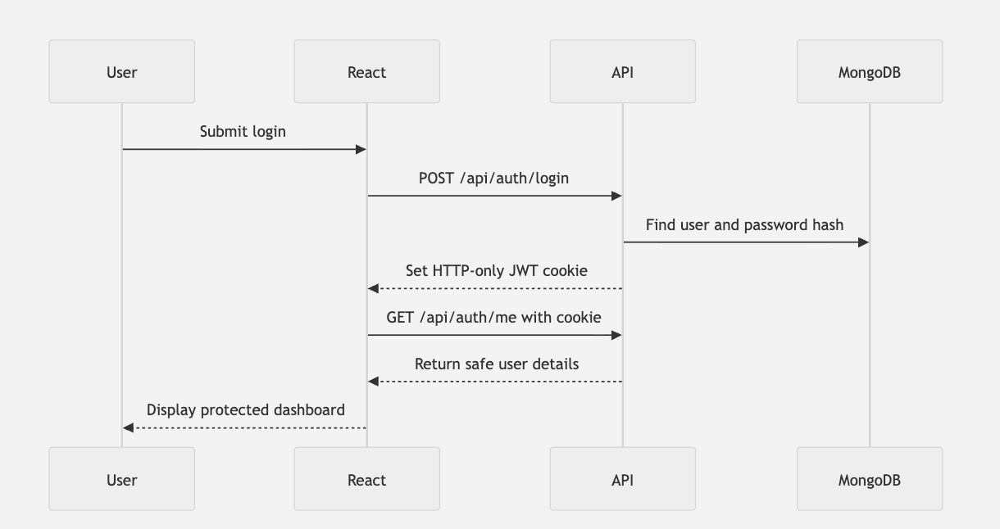

# Backend

This directory will contain the Notes App backend.

Model: defines how a user is stored in MongoDB.
Validation schema: decides whether incoming form data is acceptable.
Service: performs business logic such as hashing and credential comparison.
Controller: translates HTTP requests into service calls and responses.
Middleware: blocks unauthenticated requests before protected controllers run.
Route: maps an HTTP method and URL to middleware/controller functions.
Utility: shared JWT, cookie and error behavior.

## authentication:

### dependencies
authentication:
bcryptjs: hashes and compares passwords without native compilation; it supports TypeScript and ESM. Validate passwords at no more than 72 UTF-8 bytes because bcrypt truncates beyond that.
jsonwebtoken: signs and verifies JWTs. Use verify(), never merely decode(), because decoding does not authenticate the signature.
cookie-parser: exposes cookies through request.cookies.
zod: validates registration and login request bodies.
mongodb-memory-server: provides a disposable MongoDB instance for integration tests, protecting your real Atlas data.